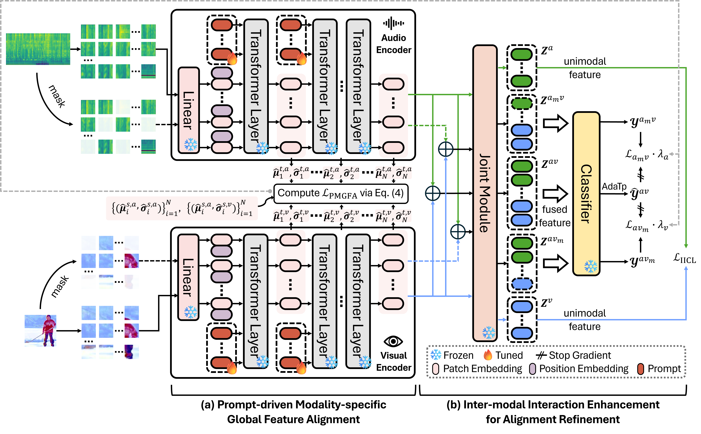

# [AAAI 2026] Bridging Modalities via Progressive Re-alignment for Multimodal Test-Time Adaptation

This is the official PyTorch implementation for Bridging Modalities via Progressive Re-alignment for Multimodal Test-Time Adaptation (**AAAI 2026 Oral**).



The repository currently supports the following methods: Source, [T3A](https://proceedings.neurips.cc/paper_files/paper/2021/file/1415fe9fea0fa1e45dddcff5682239a0-Paper.pdf), [Tent](https://arxiv.org/pdf/2006.10726), [EATA](https://arxiv.org/abs/2204.02610), [SAR](https://openreview.net/pdf?id=g2YraF75Tj), [DeYO](https://openreview.net/forum?id=9w3iw8wDuE), [READ](https://openreview.net/pdf?id=TPZRq4FALB) and BriMPR.

## Prerequisites

```shell
conda create -n mmtta -y python=3.9
conda activate mmtta
pip install -r requirements.txt
```

## Get Started

The corresponding datasets need to be downloaded:

- **Kinetics50**: Refer to [READ](https://github.com/XLearning-SCU/2024-ICLR-READ) to download the training set (optional) and validation set.
- **VGGSound**: Refer to [READ](https://github.com/XLearning-SCU/2024-ICLR-READ) to download the testing set. The training set (optional) can be downloaded from https://huggingface.co/datasets/Loie/VGGSound.

The pre-trained source model can be found in [READ](https://github.com/XLearning-SCU/2024-ICLR-READ).

**Step 1. Introduce corruptions**

```shell
# Video
python ./make_corruptions/make_c_video.py --corruption 'gaussian_noise' --severity 5 --data-path 'data_path/Kinetics50/image_mulframe_val256_k=50' --save_path 'data_path/Kinetics50/image_mulframe_val256_k-C'

# Audio
python ./make_corruptions/make_c_audio.py --corruption 'gaussian_noise' --severity 5 --data_path 'data_path/Kinetics50/audio_val256_k=50' --save_path 'data_path/Kinetics50/audio_val256_k=50-C' --weather_path 'data_path/NoisyAudios/'
```

**Step 2. Create JSON files**

```shell
# JSON file for clean data (**Mandatory**):
python ./data_process/create_clean_json.py --refer-path 'code_path/json_csv_files/ks50_test_refer.json' --video-path 'data_path/Kinetics50/image_mulframe_val256_k=50' --audio-path 'data_path/Kinetics50/audio_val256_k=50' --save_path 'code_path/json_csv_files/ks50' --split 'test'

# JSON file for source data:
python ./data_process/create_clean_json.py --refer-path 'code_path/json_csv_files/ks50_train_refer.json' --video-path 'data_path/Kinetics50/image_mulframe_val256_k=50' --audio-path 'data_path/Kinetics50/audio_val256_k=50' --save_path 'code_path/json_csv_files/ks50' --split 'train'

# JSON file for video-corrupted data:
python ./data_process/create_video_c_json.py --clean-path 'code_path/json_csv_files/ks50/clean/severity_0.json' --video-c-path 'data_path/Kinetics50/image_mulframe_val256_k=50-C' --audio-path 'data_path/Kinetics50/audio_val256_k=50' --corruption 'gaussian_noise'

# JSON file for audio-corrupted data:
python ./data_process/create_audio_c_json.py --clean-path 'code_path/json_csv_files/ks50/clean/severity_0.json' --video-path 'data_path/Kinetics50/image_mulframe_val256_k=50' --audio-c-path 'data_path/Kinetics50/audio_val256_k=50-C' --corruption 'gaussian_noise'

# JSON file for audio & video-corrupted data:
python ./data_process/create_both_c_json.py --clean-path 'code_path/json_csv_files/ks50/clean/severity_0.json' --video-c-path 'data_path/Kinetics50/image_mulframe_val256_k=50-C' --audio-c-path 'data_path/Kinetics50/audio_val256_k=50-C' --dataset 'ks50'
```

## Run Experiments

### unimodal corruption

```shell
# Kinetics50
python run.py --gpu '0, 1, 2' --tta_method BriMPR --corruption_modality [audio/video] --dataset ks50 --json_root 'code_path/json_csv_files/ks50' --label_csv 'code_path/json_csv_files/class_labels_indices_ks50.csv' --pretrain_path 'code_path/pretrained_model/cav_mae_ks50.pth'
# VGGSound
python run.py --gpu '0, 1, 2' --tta_method BriMPR --corruption_modality [audio/video] --dataset vggsound --json_root 'code_path/json_csv_files/vgg' --label_csv 'code_path/json_csv_files/class_labels_indices_vgg.csv' --pretrain_path 'code_path/pretrained_model/vgg_65.5.pth'
```

### multimodal corruption

```shell
# Kinetics50
python run_both.py --gpu '0, 1, 2' --tta_method BriMPR --corruption_modality both --dataset ks50 --json_root 'code_path/json_csv_files/ks50' --label_csv 'code_path/json_csv_files/class_labels_indices_ks50.csv' --pretrain_path 'code_path/pretrained_model/cav_mae_ks50.pth'
# VGGSound
python run_both.py --gpu '0, 1, 2' --tta_method BriMPR --corruption_modality both --dataset vggsound --json_root 'code_path/json_csv_files/vgg' --label_csv 'code_path/json_csv_files/class_labels_indices_vgg.csv' --pretrain_path 'code_path/pretrained_model/vgg_65.5.pth'
```

## Acknowledgements

Thanks for the publicly available code of [CAV-MAE](https://github.com/YuanGongND/cav-mae?tab=readme-ov-file#pretrained-models), [T3A](https://github.com/matsuolab/T3A), [Tent](https://github.com/DequanWang/tent), [EATA](https://github.com/mr-eggplant/EATA), [SAR](https://github.com/mr-eggplant/SAR), [DeYO](https://github.com/Jhyun17/DeYO) and [READ](https://github.com/XLearning-SCU/2024-ICLR-READ).

